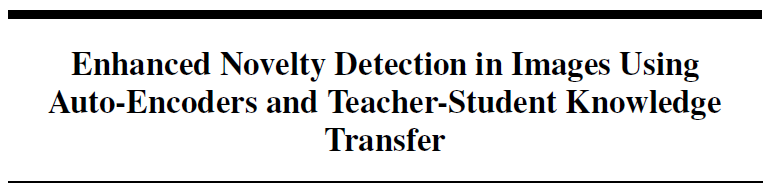

### Abstract

This work is an **attempt** to outperform the student-teacher feature pyramid matching
for anomaly detection paper [[Wang et. al.]](https://doi.org/10.48550/arXiv.2103.04257), we address it’s limitation by integrating **autoencoders**
into the **student-teacher framework**. This integration is done to better
capture anomaly features to enable effective anomaly scoring. Our proposed approach
aims to achieve results comparable to or better than the baseline framework
on the **MVTec anomaly detection dataset**. The following paper accompanies the summary on this page in greater detail.

> **Note**: This paper was not intended for publication but was created as part of a class project in a Machine Learning course. Nevertheless, it demonstrates my ability to effectively present results and articulate insights clearly and professionally.
